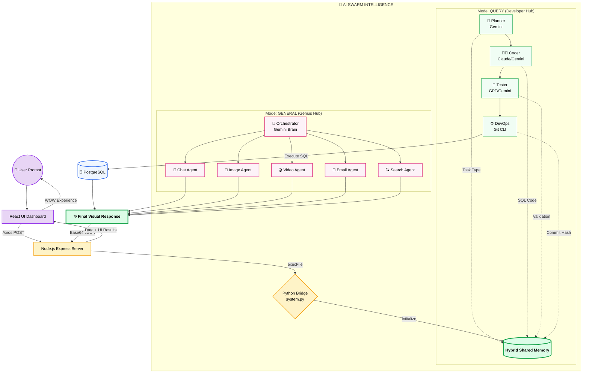

# 🌊 Multi-Agent Swarm Flow Diagram

இந்த வரைபடம் நமது சிஸ்டம் எப்படி ஆரம்பம் முதல் முடிவு வரை (End-to-End) இயங்குகிறது என்பதை விளக்குகிறது.

---

### 🗝️ முக்கிய குறிப்புகள் (Key Features):
1.  **Shared Memory**: எல்லா ஏஜென்ட்டுகளும் ஒரே 'Memory' நோட்புக்கை பயன்படுத்துகின்றன.
2.  **Autonomous Decision**: எந்த ஏஜென்ட் எப்போது வேலை செய்ய வேண்டும் என்பதை Gemini Brain முடிவு செய்கிறது.
3.  **Cross-Platform**: Node.js (Backend) மற்றும் Python (AI) இரண்டும் இணைந்து இயங்குகின்றன.
4.  **Real-Time Media**: படங்கள், வீடியோக்கள் மற்றும் ஈமெயில்கள் ஒரே நேரத்தில் உருவாக்கப்படுகின்றன.
