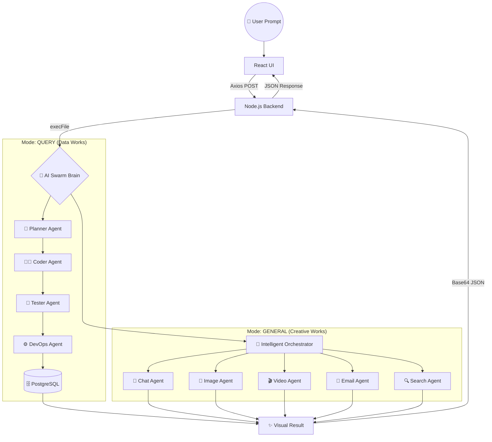

# 🚀 Multi-Agent AI System: Complete Architecture Walkthrough

இந்த சிஸ்டம் ஒரு **"Autonomous Multi-Agent Swarm"** முறையில் இயங்குகிறது. இதில் **Google Gemini (gemini-3-flash-preview)** தான் மூளையாகச் செயல்படுகிறது.

> [!TIP]
> **[AI-Swarm-Flow.md](file:///c:/Users/Surya%20Prakash/Multi%20Agent/AI-Swarm-Flow.md)** - இந்த லிங்கில் கிளிக் செய்து விரிவான **Agent Flow Diagram**-ஐப் பார்க்கலாம்! 📊✨

## 📊 Agent Interaction Diagram (வரைபடம்)

---

## 🏗️ 1. Frontend: பயனர் இடைமுகம் (The Interface)
*   **React 19 + Vite**: வேகமான மற்றும் அழகான UI-க்காக இது பயன்படுத்தப்படுகிறது.
*   **Dual Mode Selection**: பயனர் `Query Mode` (Database வேலைகள்) அல்லது `General Mode` (AI Chat/Media) என இரண்டில் ஒன்றைத் தேர்ந்தெடுக்கலாம்.
*   **Step-by-Step Flow**:
    1. User ஏதோ ஒரு Prompt-ஐ (மற்றும் Mode-ஐ) டைப் செய்கிறார்.
    2. `Search.jsx` அந்தத் தகவலைப் பெற்று `Axios.post('/api/agent')` வழியாக பேக்கெண்டிற்கு அனுப்புகிறது.

---

## 📡 2. Backend: தகவல்தொடர்பு பாலம் (The API Bridge)
*   **Node.js + Express**: நமது பிரதான சர்வர். இது எல்லா API Request-களையும் கையாளும்.
*   **The Python Bridge**: Node.js நேரடியாக AI வேலையைச் செய்யாது. அது `agents/system.py`-ஐ `child_process.execFile` மூலம் இயக்கும். 
*   **Base64 JSON**: பைதான் தனது முடிவுகளை `===AGENT_B64_START===...===AGENT_B64_END===` என்ற விசேஷ வடிவத்தில் (Encoded) ரிட்டன் தரும். Node.js இதைத் தரம் பிரித்து தேவையான வேலையைச் செய்யும்.

---

## 🧠 3. ஸ்வார்ம் சிஸ்டம்: குவரி மோடு (Query Mode Swarm)
இதில் 4 ஏஜென்ட்டுகள் ஒரு வரிசையில் (Pipeline) வேலை செய்கிறார்கள்:

1.  **Planner (Gemini)**: "நோக்கத்தை அறிபவர்". பயனரின் பிராம்ப்ட்டைப் படித்து இது `insert_employee` ஆ? அல்லது `query_data` ஆ? என்று முடிவு செய்வார்.
2.  **Coder (Gemini/Claude)**: "கோடிங் மேதை". Planner சொன்ன வேலைக்குத் தேவையான **SQL குவரிகளை** உருவாக்குகிறார்.
3.  **Tester (Gemini/GPT)**: "டெஸ்டிங் அதிகாரி". Coder உருவாக்கிய குவரி பாதுகாப்பானதா? சரியாக இருக்குமா? என்று செக் செய்வார். தப்பு இருந்தால் பிளாக் செய்வார்.
4.  **DevOps (Git CLI)**: "டெப்ளாய்மென்ட் ராஜா". ஒருவேளை "Code Push" வேலை இருந்தால் மட்டும், Git கட்டளைகளைப் பயன்படுத்தி GitHub-க்கு தள்ளுவார்.

---

## 🎨 4. ஸ்வார்ம் சிஸ்டம்: ஜெனரல் மோடு (General Mode Swarm)
இதில் ஒரு **ஒற்றை மூளை (Unified Brain)** பல தொழிலாளர்களை இயக்குகிறார்:

1.  **Intelligent Orchestrator**: ஜெமினி தனது முழு பலத்தைப் பயன்படுத்தி, இந்த வேலைக்கு எந்தெந்த கருவிகள் (Tools) தேவை என்று முடிவெடுப்பார்.
2.  **Specialist Workforce**:
    *   💬 **Chat Agent**: அறிவார்ந்த பதில்களைத் தருவார்.
    *   🎨 **Image Agent**: நிஜமான படங்களை இணையத்திலிருந்து கொண்டு வருவார்.
    *   🎬 **Video Agent**: YouTube/Pexels வீடியோக்களை ரிலீஸ் செய்வார்.
    *   📧 **Email Agent**: SMTP மூலம் ஈமெயில்களை நிஜமாகவே அனுப்புவார்.
    *   🔍 **Search Agent**: கூகுளில் செர்ச் செய்து லேட்டஸ்ட் நியூஸைக் தருவார்.

---

## 💾 5. டேட்டாபேஸ்: தரவுத் தளம் (PostgreSQL)
*   **Render PostgreSQL**: நமது எல்லா தரவுகளும் (Employees, Attendance, Leaves) இங்குதான் சேகரிக்கப்படும்.
*   **Simulation Check**: ஒருவேளை டேட்டாபேஸ் வேலை செய்யவில்லை என்றால், சிஸ்டம் தானாகவே "Simulation Mode"-க்கு மாறி இன்-மெமரி டேட்டாவைப் பயன்ப்படுத்தும்.

---

## 🏁 6. முடிவு (Final Loop)
எல்லா வேலைகளும் முடிந்ததும், பைதான் தரும் `JSON` ரிசல்ட்டை Node.js எடுத்து, அதில் `sql_queries` இருந்தால் அதை டேட்டாபேஸில் ரன் செய்யும். பின்னர் அந்த டேட்டாவை (மற்றும் AI கொடுத்த பதில், படங்கள் போன்றவற்றை) அப்படியே React-க்குத் திருப்பி அனுப்பும். அங்கே அழகான **Glassmorphism UI**-ல் பயனர் பார்க்கலாம்.

---
> **"This is the future of Agentic Coding — multiple AIs working as One!"** 🚀🤖✨
